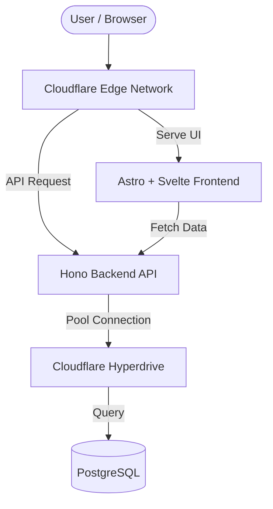

# 🎟️ Jeevatix

> **Menghidupkan Setiap Momenmu.** > **Akses Cepat, Nyalakan Energimu.**

Jeevatix adalah platform jual beli tiket *event* berkinerja tinggi yang dirancang untuk menangani lonjakan *traffic* ekstrem (*war ticket*). Dibangun sepenuhnya di atas arsitektur *edge-computing* dan *serverless* untuk menjamin kecepatan, skalabilitas, dan keandalan transaksi secara *real-time*.

---

## 🚀 Tech Stack

Platform ini menggunakan pendekatan *monorepo* dengan perpaduan teknologi berikut:

* **Infrastructure as Code (IaC):** [SST (Serverless Stack)](https://sst.dev/)
* **Edge Compute:** Cloudflare Workers
* **Backend / API:** [Hono](https://hono.dev/) (Super-fast, lightweight web framework)
* **Frontend:** [Astro](https://astro.build/) (Islands Architecture) + [Svelte](https://svelte.dev/) (Interactive UI)
* **Database & Connection Pooling:** PostgreSQL (Self-Hosted) + Cloudflare Hyperdrive

---

## 🏗️ Architecture Diagram



---

## 📂 Monorepo Structure

Repositori ini diatur ke dalam beberapa *workspace* untuk memisahkan logika bisnis, API, dan antarmuka pengguna, namun tetap berbagi tipe data (*type safety*) yang sama:

```
jeevatix/
├── apps/
│   ├── api/            # Hono app (berjalan di Cloudflare Workers)
│   └── web/            # Astro + Svelte frontend (UI Utama)
├── packages/
│   ├── core/           # Logika bisnis utama, koneksi database, utils
│   └── types/          # Shared TypeScript interfaces (Event, Ticket, dll)
├── sst.config.ts       # Konfigurasi infrastruktur SST
├── package.json        # Root package (Workspaces config)
└── README.md
```

---

## 🛠️ Prerequisites

Sebelum memulai *development* di *environment* lokal Anda, pastikan Anda telah menginstal:

* **Node.js** (v18 atau lebih baru)
* **pnpm** (Direkomendasikan untuk manajemen *monorepo* yang efisien)
* Akun **Cloudflare** (untuk konfigurasi *deployment* dan Hyperdrive)
* **PostgreSQL** (Berjalan di server lokal atau server *self-hosted* Anda)

---

## 💻 Getting Started

Ikuti langkah-langkah berikut untuk menjalankan Jeevatix di mesin lokal Anda:

### 1. Clone Repository & Install Dependencies

```bash
git clone https://github.com/ariefnovianto/jeevatix.git
cd jeevatix
pnpm install
```

### 2. Setup Environment Variables
Duplikat file `.env.example` menjadi `.env` di *root directory* dan isi variabel yang dibutuhkan, terutama untuk string koneksi ke database PostgreSQL Anda:
cp .env.example .env


### 3. Jalankan Local Development (SST Live)
Perintah ini akan menyalakan *local environment* untuk semua aplikasi (Web & API) sekaligus menghubungkannya ke *resource* cloud pribadi Anda secara *real-time*:
pnpm run dev

* **Frontend (Astro/Svelte):** `http://localhost:4321`
* **Backend (Hono API):** `http://localhost:3000`

---

## 🧪 Testing

Aplikasi berskala tinggi membutuhkan pengujian yang ketat. Anda dapat menjalankan pengujian dengan perintah berikut:

* **Unit & Integration Test:** `pnpm run test` (menggunakan Vitest)
* **Load Testing:** `pnpm run test:load` (menggunakan K6 untuk mensimulasikan *war ticket*)

---

## 🌐 Deployment & CI/CD

Proses *deployment* ke *production* sepenuhnya diotomatisasi menggunakan **GitHub Actions**. Setiap PR atau *merge* ke *branch* `main` akan memicu *pipeline* CI/CD untuk memastikan semua *test* berlalu sebelum melakukan *build* dan *deploy* ke Cloudflare.

Namun, jika Anda perlu melakukan *deploy* manual dari mesin lokal, Anda dapat menjalankan:

```bash
pnpm run build
pnpm run deploy --stage production
```

---

## 📝 License

Hak Cipta © 2026 Jeevatix. All rights reserved.